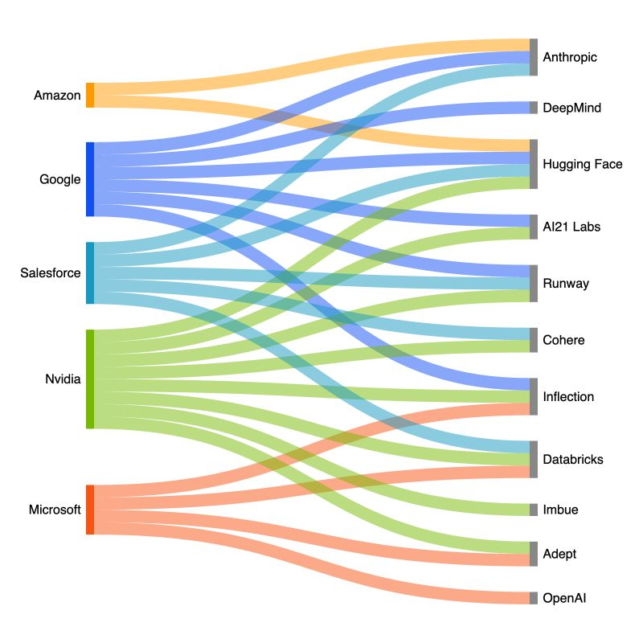

## Surface VS Deep Structure 

It's 18 January 2024, Open AI announced its market place 10 days ago,
however, users are not welcomed as the presentation by Sam Altman showed.

Another thing is that the concept was first introduced by Quora, the Poe, an
AI marketplace platform.

But it's just the surface, when we look at the data, microsoft pass the apple
as the most valuable company of the US.

What does it mean? 

One possibility is that its not the war of AI, it's a war about hardware,
and new architectures are just a mean to use the hardware, it's not a
new concept, hardware is sustainable, but for the matter of success in the field of
hardware you should offer the best possible service. 

That's why Microsoft buy Open AI. it's not because GPT-4 is the best 
language model (and it's not in many criteria). It's about it dictates
a compelling brand to all the end-users, so it worths to buy. As it's a battle of semi-conductors.

## The Rise of the East

BYD proofs that we are entering into new era, in which silicon valley based companies are nearly dead. It’s not about fancy workplaces or how much you care about a 
human-centered design, it's about the creating value-profit first. People do not care about how someone told something is important, they care about their actions.
US-based companies tries to gain the maximum advantage by their government as it pass the dept of the country to other third-world countries. But now, it's not 1990.
Even A16Z, one of the famous VC companies are looking for limited partners in the United Arab Emerates. That's a huge shift. 

## The World Needs More Balance 
I watched a 
