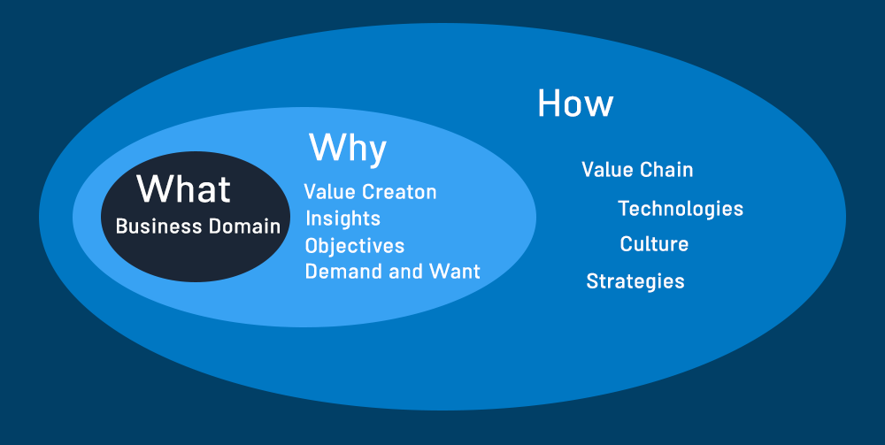

### Fallacies
---
When it comes to biases, first we should define what are fallacies. Reasoning is the base of the language. Language is the one that makes us different from other
species. Reasoning helps us define what is truly work and what's not. Reasoning happens inside our head and we describe it by using the language, and as a result, arguments
beget. Fallacy is a wrong argument, the argument that does not work. It may be deceptive, manipulative or just mistaken because of having a dangling reasoning.

The most common breakdown of fallacies are formal and informal, Although there are other breakdowns like what Aristotle had done; linguistic and non-linguistic fallacies.
People sometimes underestimate the power of fallacy. We make fallacies in our routines. from simple to complex ones. But none of them are as harmful as the <b>oversimplification</b>.

### Oversimplification Fallacy
---
As cognitive science researchers suggested [1],
the number of individual variables human can mentally handle while trying to solve a problem (like baking a lemon meringue pie) is relatively small:
Four variables are difficult; five are nearly impossible. So when it comes to success of Apple, people oversimplify a complex path to just success of one person.
As a result, people would miss the consequence of remove or add something from their daily life. Think about the Tesla, many believe that they produce cars with near to zero waste. But particle
pollution from electric cars could be worse than from diesel ones (Because of their emissions from wear of brakes compared with conventional vehicles).

In our era, the increasing availability of information lead us to simplify any complex structures. <b>Illusory truth effect</b> [2] lead us to believe there is one single
factor that cause something, without any further process. Repeated statements receive higher truth ratings than new statements, and then they become facts. For Hacking the non-improvement biases, we should
deep down to unknown statements and analyse them and then, accept them. Hopefully there are many valid sources and google also helps us to find trustworthier sources through its algorithm.

### Independent-Minded People
---
I got a lot of respect for Paul Graham, founder of Ycombinator. He uses the term of <b>Independent Mind</b> along with <b>Conventional Mind</b>. he claimed that
one of the most revealing ways to classify people is by the degree and aggressiveness of their conformism. He divided
people into 4 types; aggressively conventional-minded, passively conventional-minded, passively independent-minded, and aggressively independent-minded.
There are rules that developed by old ones. If you want to
make a progress, first you should break them. but breaking the rules is not necessarily leads to progress. When we scrutinize the characteristics of
entrepreneurs, we may find them as a heretic person, but they actually just not fit in our framework.

He argued that independent-minded need to be protected
Because they have all the new ideas. To be a successful scientist, for example, it's not enough just to be right.
You have to be right when everyone else is wrong. Conventional-minded people can't do that. For similar reasons,
all successful startup CEOs are not merely independent-minded, but aggressively so. So it's no coincidence that societies prosper
only to the extent that they have customs for keeping the conventional-minded at bay.

How this happen? why some become frontiers and change the way we think? I think that fallacies and reasoning is the pivot of matter.
Although I believe that you can't improve this skill by just practice, but you could at least perform better by know more about fallacies that would be happen.
By asking the question of can I be wrong and self-criticizing you will improve this ability to see unseen deepness.

### Onion Structure
---
We could not experience our lives from top to down. It's a common fallacy that we fall into. When we want to analyze a historical situation, we put
our self in shoes of the people in that era and then we assess the occasion.
One of the fallacies that I've faced during my experience is that people try to model their perspectives from a bottom-up experience, and not the top-down.
Their common fallacy is about the philosophy of the business, the culture and a invisible line between sciences. They underestimate the role of the language in their
modeling and it has consequences.
In Wish Work, we try to break these invisible lines. There are philosophies that lead us, not roles and titles, not a organization chart. I think that organization
chart and modeling the culture is a awful idea. because you try to pour the air in the bowl. It's near to impossible. It's not because you can't, It's because you shouldn't.
I know that when you model something you give a better perception about, but that's not work in this case.
So instead of this, we come up we the idea of breaking the philosophy. the philosophy of our works.

This image is a model and it has it's own problems also. In addition, we are biased and I admit that (which contradictd with the title of this article). but at least we try not to develop a useless framework. We came
one step behind and asking ourselves what are we going to do? why we do it and how we will do. Then terms, tasks and descriptions emerged.
Hence, sometimes we try to re-engineering our philosophy and models to reduce fallacies and costs that may face. But how we do that? by hacking the bias.

---

import {TwitterButton, LinkedinButton} from '../share-buttons.js'

  <TwitterButton link="https://shirani.me/programming-or-painting"/>
  <LinkedinButton link="https://shirani.me/programming-or-painting"/>

 
 
 
 
 

<Text> Footnotes:
</Text>
<Text>
[1]: For more information visit <a href="https://www.eurekalert.org/pub_releases/2005-03/aps-hmc030805.php" target="_blank">here</a>.
</Text>
<Text>
[2]: For more information visit <a href="https://en.wikipedia.org/wiki/Illusory_truth_effect#:~:text=The%20illusory%20truth%20effect%20(also,be%20correct%20after%20repeated%20exposure.&text=The%20first%20condition%20is%20logical,already%20know%20to%20be%20true." target="_blank">here</a>.
</Text>
