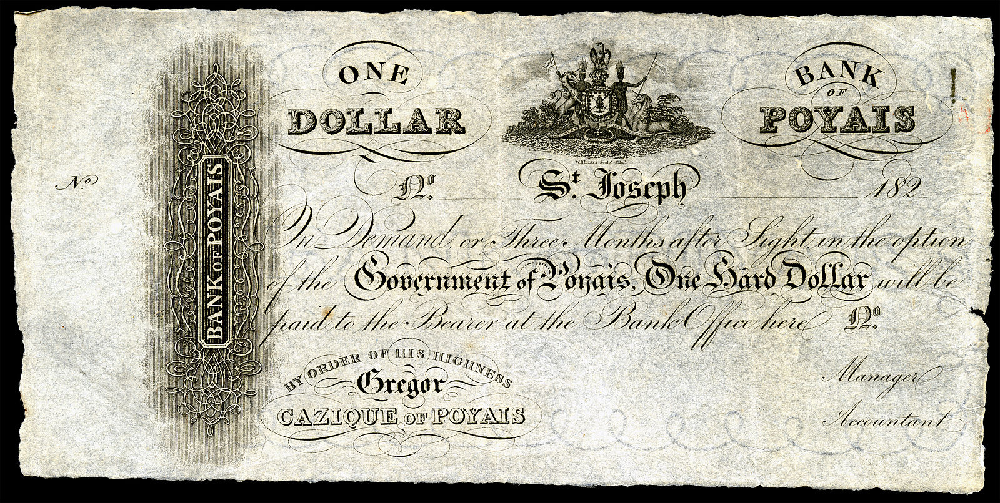

## Hunters
---
When we look at nature, we may find out one of the common traits that any mammal has is hunting for its existence.
These hunting could be segmented into two sections, win-hunt and lose-hunt. In the lose-hunt circumstance,
there is a zero-sum game; one side will always be an also-ran; however, both sides will make the most of the interaction in the win-hunt.
An example of a lose-hunt would be hunting for the matter of nurturing. On the other hand, mating could be counted as a win-hunt as both
parties are satisfied with their interaction.

In human societies, win-lose games are not sustainable. The availability of information leads to the importance of something like reputation.
So win-win games are more desirable and sustainable than win-lose games. <b>The double thank-you of capitalism</b>[1] shows that win-win games are more
sustainable because both sides are giver and taker at the moment. It's the primary benefit of the free market. So when you think about hunting,
you think about how I could benefit from another person's existence in the short and long run. Selling what you already have is the way you
communicate with others to create value for yourself. When someone appreciates you and is happy with that person's satisfaction,
the double thank-you would emerge. If you offer, for instance, a cake to a customer, you will be thankful for the money that the
customer gives you, and the customer is grateful for the cake that you provide to him.

As you try to sell, you should negotiate and convince people that you have a great offer and add value. There are two main groups of
people who are adept in selling, <b>Scammers</b> and <b>Entrepreneurs</b>.

## Scammers and Entrepreneurs
---
Politicians, journalists, programmers, athletes, and everyone tries to sell and promote his value to society.
That's why you've been told to find your talent and aptitude and then work hard on it. Because then you could
sell these values to the society. All of us are sellers. The fact that people don't like salespeople is because
selling is more than its words. You are selling your experience, and people pay for it. It is also more than technical
aspects of software; it's about the experience that its users have. Even a nerd programmer tries to sell himself as a nerd.

Entrepreneurs and Scammers are good at this skill. As we look at the history after meritocracy, entrepreneurs and inventors
have had the most influence on society. As British economist James Robinson mentioned in his book <b>Why Nations Fail</b>,
the ideal process for a community to create benefits for its people is based on the value they create for their society.
If you make ten value, you will receive 8, and not 12 or 2. However, inclusive politics would apply this mechanism. And Entrepreneurs
and Inventors create the most value for society with inclusive economic and politic institutions.
But another group of people that are good at selling is Scammers. They
These happenings are like the <b>Poyais scheme</b>[2] by Gregor MacGregor when he tried to mount an aggressive sales
campaign for selling an
island that does not even exist.

<Text sx={{display: 'flex',justifyContent: 'center', color: `primary`, fontSize:'10pt'}}><i>A Bank of Poyais "dollar", printed in Scotland. MacGregor bartered these worthless notes to his would-be settlers, taking their real British money in exchange.
</i></Text>

 

People are afraid of long-term commitment and would be gulled if they'll give a promise to be successful
for making just one wise decision. Scammers know this fact and gain an advantage from it. So the fact that most overnight successes took a
long time disappeared in their mind. Unfortunately, scammers' persona is like entrepreneurs. Both try to encourage society to make better
decisions and buy the value that they create. But one of them abuses the community for the short term. The reason behind that is maybe
scammers lack creative thinking to make a real value and then sell it, but entrepreneurs do vice versa. Entrepreneurs also sell, but people
love them because they make value available in a win-win context when they create something. They have more confidence, and they want a long
relationship with society. Nonetheless, both types have inborn expertise in selling and, in fact, scaling mindset.

## Fair Cake-Cutting Delusion
---
Libertarian has a scaling problem. It's a flawed ideology. Societies always have tried to get closer to the ideal community where everyone could
buy or sell whatever they want. All the same, there has always been a supreme being entered when contradictions emerge as a divine judgment.
When you want to divide fairly among a community, there are different perceptions of fairness. There are some approaches like proportion cutting
that help one to divide a cake. For example, for two people, divide and choose is the classic solution. One person divides the resource into
what they believe are equal halves, and the other person chooses the "half" they prefer. The non-atomicity assumption guarantees that the cutter
can indeed cut the cake into two equal pieces; the additivity assumption guarantees that both partners value their pieces as at least 1/2.

But there will be some fallacies always there when you try to extend these models into the capital. When you want to distribute wealth, it's not
like the distribution of something like a person's weight. The distribution of the weight of a person is close to Gaussian Distribution with low
variance. The probability of the existence of a human with more than 300-kilogram weight is near to zero. But when it comes to something
like wealth, it has nothing in common with weight. The variance is so high that you could not fit the Gaussian Distribution to it.
Nasim Nicolas Taleb argued that it is more like Mandelbro Distribution. But with any distribution, this may result from another thing, mindset.
The mindset of individuals has a significant amount of difference because they make different amounts of value for their society. That's one of
the reasons related to why the marxism approach hadn't worked.

Owing to this fact, we could not expect the same amount of skill among people for something like sales as it's one of the value proposition
processes to society. And it's not fair, and I admit that, but it exists and is very important.

## People Scale, Not Businesses
---
When I decided to write this essay, the title was different. The title was related to why some companies turn to billion-dollar companies,
and some failed repeatedly.
But when I commenced writing, I find out it has nothing to do with businesses, industries, or anything like that.
It relates to people. So I changed the title.
Businesses and startups do not scale. Actually, the founders make companies take off. The team behind every successful
product or idea makes something scale.
People think that if there is a market, then your product will be successful, and if it doesn't, you are going to downfall.
But it's not true. Maybe there is a fascinating market, but what is it? It's a pain,
and you should create a solution for that. It would help if you solved the demand for something. So it would be best if you
had a great team; otherwise, you wind up in a fractionable situation and couldn't resist. And what if there is not a market that you
think exists? Nothing happens if there is a good team. Slack team pivot from a game studio into a fast-growing startup that does not
relate to their previous market.
Selling is one of the critical attributes of scaling. If you could not propose your value, maybe there is no value there to offer,
and you are in a dreamy world. Selling is about knowing how the human mind works.
And you create value for humanity. So do not underestimate the sales as a part of your value.
