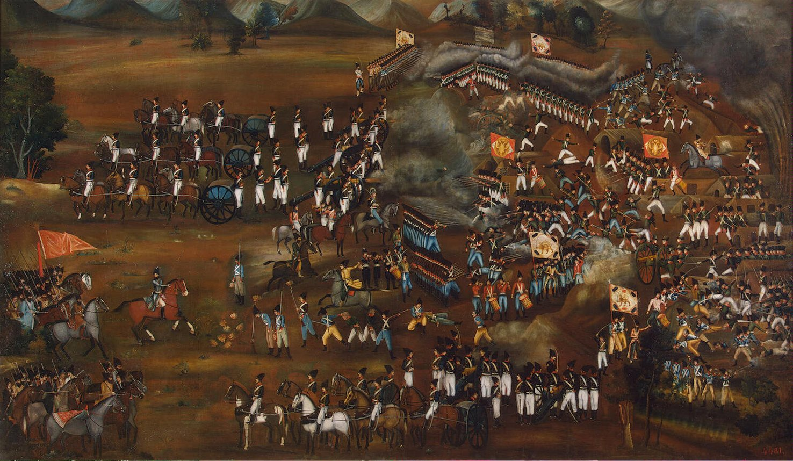

### Programmers == The People
---

Today, we live in an era in which statistics show that the community of programmers will increase drastically in near future. We will have about 50 million software engineers
across the globe. so who they are? they are normal people. software became pop. However, there will be a huge gap between a mid-programmer and the exceptional one.

| Year   |      Number of Software Developers       |
| ------ | ---------------------------------------- |
| 2018   |   23.9 million                           |
| 2019   |   26,4 million                           |
| 2023   |   27,7 million                           |
| 2024   |   28.7 million                           |
| 2030   |     45 million                           |

This common pattern has been observed since the emergence of society discretely. There were always intellectuals who leads, and others who follow them. In recent years,
Internet and Computers are the one of the biggest novel achievements in the human history. Hence, the community of programmers has been increased. but that's not the thing...

### There is no Best Practice
We should notice that today's "best practices" lead to dead ends; the best paths are new and untried. Technology is a really great point of difference, as you can
hit the ground and capture all the market. Think about Tesla, think about the way it change automobile industry and forced it's competitors to react. It's all about the
technology, and today's technology is The <b>Internet</b> and <b>Computer</b>. But we could not predict what will be in near future. Which one has more potential market?
Augmented Reality? or Cloud Services? or Crypto? we should accept that we could not predict more than 5 years. But also we could leverage from now to say that today's
best practices are not good enough to last.

### Artists Lead
---
As we look at the history, we found that the technology has been always existed. In wars, technology brought a great advantage as the enemy could not resists against.
In Russo-Persian war-series in 1804 - 1805[1], the pivot of the matter caused the Iranian army defeated was they didn't benefit from the invention of firearms.
Societies always try to gain more advantage from technologies. Today's the main war is economy. and the reason some technologies had been emerged is
because some intellectuals was trying to solve an old-existing problems. and then it propagates.

<Text sx={{display: 'flex',justifyContent: 'center', color: `primary`}}><i> A painting which is related to <b>1814-1815</b> picturing victorious of <b>Abbas Mirza</b> </i></Text>

The way this happen, is related to <b>Artists</b>. Artistic thinking about practical problems is a really hard way. they focus on the problem, try their solutions and then
encourage others to boost their probability of success by using the introduced solution.

### Artistic Programmers
There has been a debate that if we should reinvent things or not. Individuals focus on the products and not
the solution. Think about long since debate related to Mac or Linux. People bias about the instruments.
issues that had nothing to do with problems. The intellectual programmer does not reinvent the wheel or if he did, just as a matter of practice and insight.
Artistic programmers try to solve real issues, not dreamy one. In today's world, there are many integrations that help people to develop easily and of course it
will be more in future. But we should focus on problems like how can we solve banking problems, and then block-chain answer would arise.

### Future
Due to the economy, when something become popular, the price of compliment products increase. Owing to this fact, if software become popular, software engineers who
are capable to think differently would lead the world. So, although <b> there would be more programmers, there will be still lack of artistic thinking</b>.

---

import {TwitterButton, LinkedinButton} from '../share-buttons.js'

  <TwitterButton link="https://shirani.me/programming-or-painting"/>
  <LinkedinButton link="https://shirani.me/programming-or-painting"/>

 
 
 
 
 

<Text> Footnotes:
</Text>
<Text>
[1]: For more information, read <a href="https://en.wikipedia.org/wiki/Russo-Persian_War_(1804%E2%80%931813)" target="_blank">here</a>.
</Text>
 
<Text>
<b>Thanks</b> to Niloofar Ghasemzadeh, Bahador Alizadeh for reading drafts of this.
</Text>