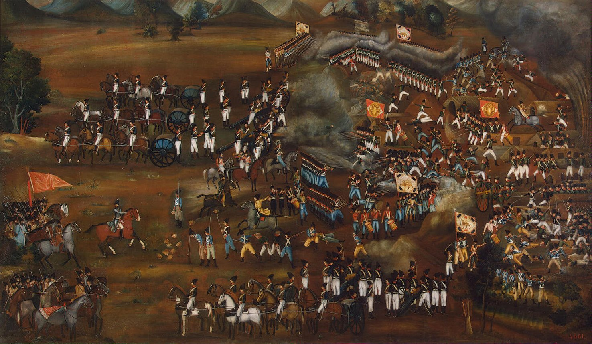

### Programmers == The People
---

Today, we live in a area in which statistics shows that the community of programmers will increase drastically in near future. We will have about 50 million software engineers
across the globe. so who they are? they are normal people. software became pop. However, there will be a huge gap between a mid-programmer and the exceptional one.

| Year   |      Number of Software Developers       |
| ------ | ---------------------------------------- |
| 2018   |   23.9 million                           |
| 2019   |   26,4 million                           |
| 2023   |   27,7 million                           |
| 2024   |   28.7 million                           |
| 2030   |     45 million                           |

However, this pattern has been observed since the emergence of society. There were always intellectuals who leads, and others follow them. In recent years,
Internet and Computers are the biggest achievement of the human. So The community of programmers has been increased. but that's not the thing...

### There is no Best Practice
We should notice that today's "best practices" lead to dead ends; the best paths are new and untried. Technology is a really great point of difference, as you can
hit the ground and capture all markets. Think about Tesla, think about the way it change automobile industry and forced it's competitors to react. It's all about the
technology, and today's technology is The <b>Internet</b> and <b>Computer</b>. But we could not predict what will be in near future. Which one has more potential market?
Augmented Reality? or Cloud Services? or Crypto? we should accept that we could not predict more than 5 years. But also we could leverage from now to say that today's
best practices are not good enough to last.

### Artists Lead
---
As we look at the history, we see that always technology exists. In wars, technology brought a great advantage as the enemy could not resists against.
In Iran-Russia war-series in 1790, one main thing that cause the Iranian army defeated was that they didn't benefit from the invention of firearms. Internet becoming a
next big thing, originated from US military. Societies always try to gain more advantage from technologies. Today's the main war is economy. and the reason some technologies had been emerged is
because some intellectuals was trying to solve an old-existing problems. and then propagate it to the pop.

The way this happen, is related to <b>Artists</b>. Artistic thinking about practical problems is a really hard way. they focus on the problem, try their solutions and then
encourage others to boost their probability of success by using the introduced solution.

### Artistic Programmers
